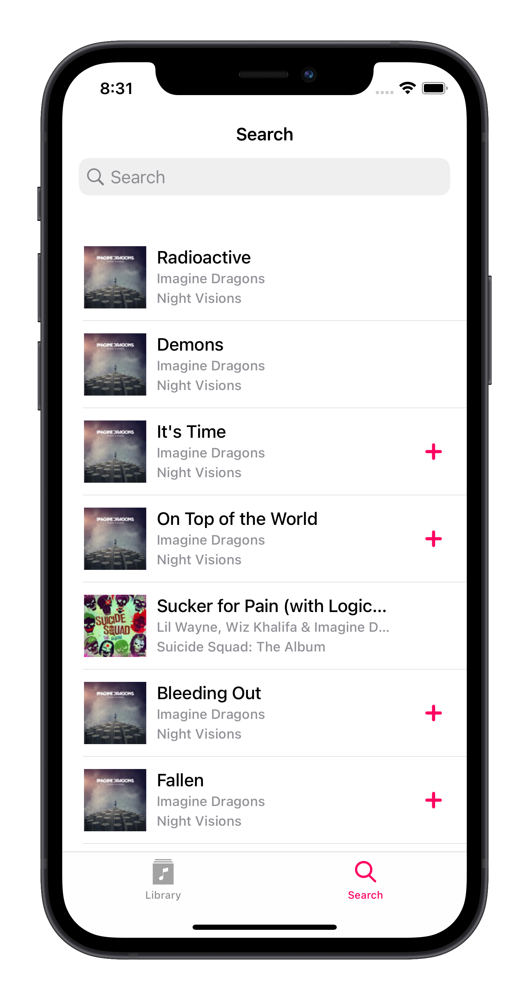
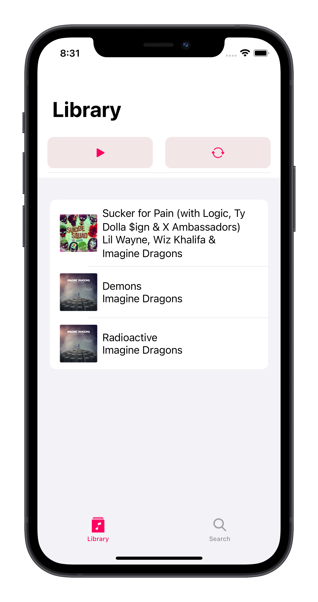
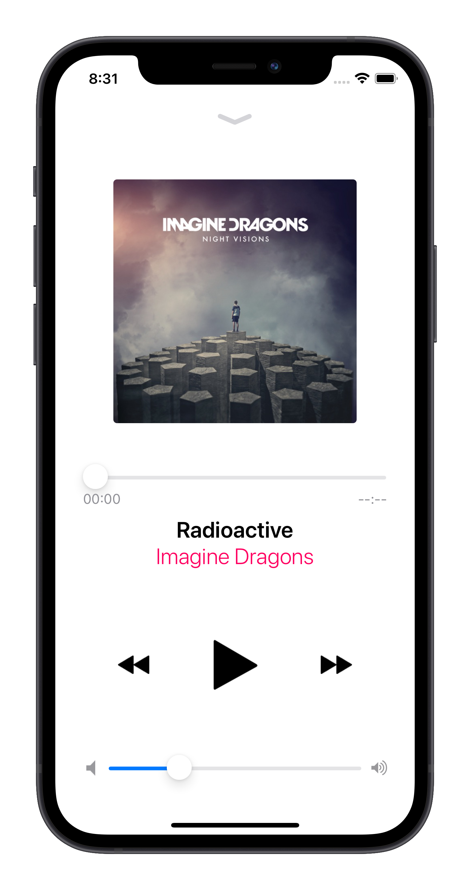

# MusicPlay App
 
    

        iOS pet project application for searching and listening music
    

## Requirements
- IPhone 11+
- iOS 13.0+

## About
- UIKit, SwiftUI
- Interface Builder: Storyboard, XIB, programmatically designed UI with NSLayoutConstraints
- ITunes API for music data
- Clean Swift architecture
- SPM dependecies: Alamofire, SDWebImage, URLImage
- Library screen performed with SwiftUI

